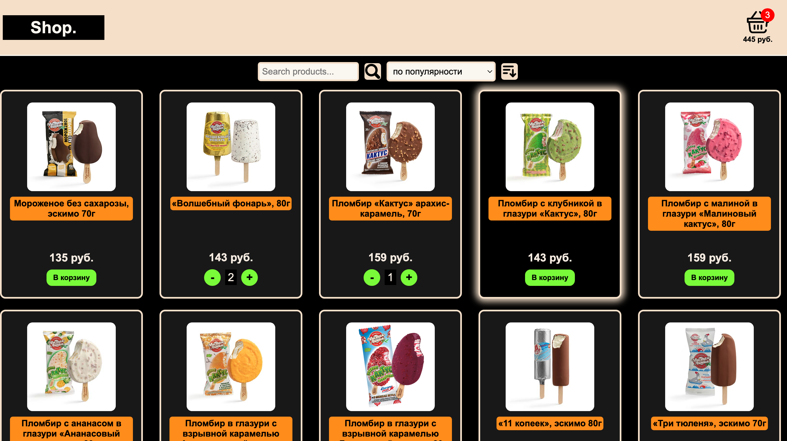
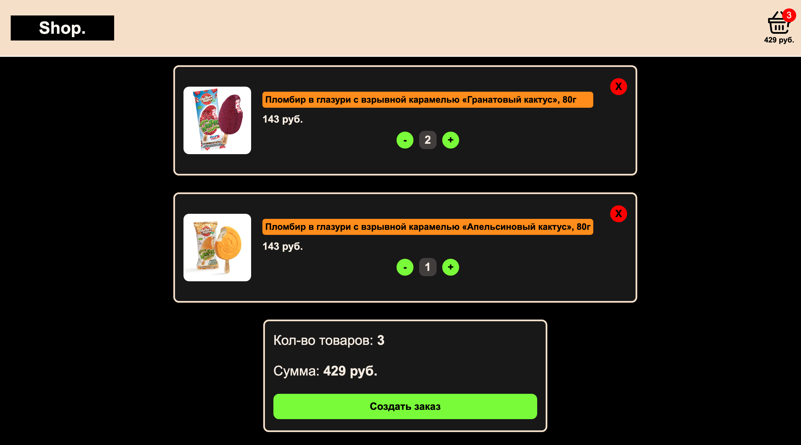
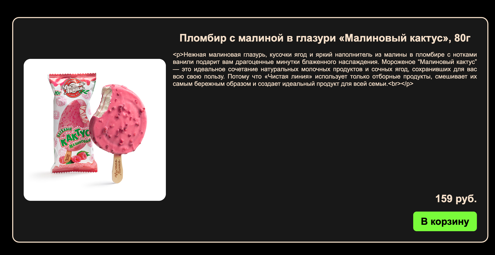

Запуск программы:

### `npm i`
### `npm start`

Если вдруг возникли ошибки (устаревшие версии/обновления), то удалить файл **package-lock.json** с зависимостями и заново выполнить:
### `npm i`

**Главная страница магазина с поиском и сортировкой товаров, добавлением их в корзину и изменением количества товаров в корзине**

**Сверху на навигационной панели при клике на корзину происходит переход на страницу корзины с добавленными товарами,
где можно изменять количество и удалять полностью категории товаров**

**При клике на название магазина происходит переход на главную страницу.
При клике на изображение товара можно перейти на страницу конкретного товара**
